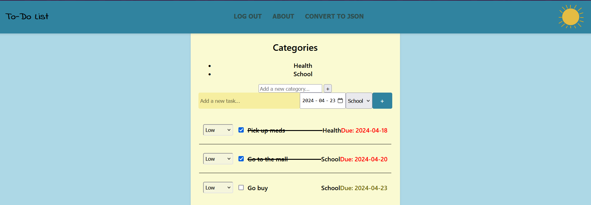

### Project Information
This project involves developing a To-Do list application. The server interacts with the client which uses mostly HTML/JS for the user interface. It will support login, task creation with names and due dates, and priority levels to indicate whether a task is a high, medium, or low priority. There are also categories under which tasks can be categorized.

#### Group Members:
- [Oluwateniola S. Adegbite](https://www.linkedin.com/in/teni-adegbite)
- [Jacob Lamb](https://www.linkedin.com/in/jacob-lamb-27aa7624b/)
- [Yousef Waiel Said](https://www.linkedin.com/in/yousef-waiel/)
- [Ishaan Takrani](https://www.linkedin.com/in/ishaan-takrani/)

| Name                     | Student Number | GitHub username       |
|--------------------------|----------------|-----------------------|
| Oluwateniola S. Adegbite | 100861337      | oluwateniola-adegbite |
| Jacob Lamb               | 100871131      | jacobLamb04           |
| Yousef Waiel Said        | 100857349      | yousefwaiel           |
| Ishaan Takrani           | 100863042      | IshaanTakrani         |

[Video demonstration](https://drive.google.com/file/d/10zSqRS3IGfghUo3kR7WJAo7HAffIIwD4/view?usp=sharing)



# How to Run

#### Prerequisites
Ensure the following prerequisites are installed on your system:
- Java Development Kit (JDK)
- Apache Maven
- Git

#### Step 1: Clone the Repository

1. Open your terminal or command prompt.
2. Navigate to the directory where you want to clone the repository.
3. Run the following command to clone the repository:
   ```bash
   git clone https://github.com/OntarioTech-CS-program/w24-csci2020u-final-project-said-takrani-lamb-adegbite.git

#### Step 2: Open IntelliJ Projects
1. Launch IntelliJ IDEA.
2. Choose Open Project and navigate to the directory where you cloned the To-Do list repository.
3. Select the To-Do list project and click Open.

#### Step 3: Run the Server
1. In IntelliJ, open the To-Do list project.
2. Set up and configure the Glassfish server.
3. Run the Glassfish server.
4. The server should start, and you should see an output indicating that the server is running on http://localhost:8080.

#### Step 4: Access the Application
1. Open your web browser and go to http://localhost:8080/Todo_List-1.0-SNAPSHOT/.
2. The To-Do List Server application should be accessible, allowing you to log in and add tasks.

##### Step 5: Troubleshooting
- Ensure your JDK is configured correctly, and IntelliJ projects are set up properly.
- Check for any IntelliJ console error messages indicating project dependencies or configuration issues.
- Verify that port 8080 is available and not being used by another application.

### Design Resources
- [Day/Night](https://www.youtube.com/watch?v=MNf8DUej1Vo)
- [Font](https://fonts.google.com/specimen/Indie+Flower?classification=Handwriting)

### Other Resources
- [Java Date()](https://developer.mozilla.org/en-US/docs/Web/HTML/Element/input/date)
- [Javascript Timestamp](https://www.freecodecamp.org/news/javascript-timestamp-how-to-use-gettime-to-generate-timestamps-in-js/)
- [Javascript Colour](https://www.w3schools.com/jsref/prop_style_color.asp)
- [About Me Page](https://codepen.io/nsieber/pen/vOVQgg)

### Contribution Report
All tasks were equally distributed among group members based on their expertise and skill level:
- Ishaan Takrani: Frontend Javascript and Category/Priority drop-down features, POST request login, POST convert/download tasks as JSON api. 
- Oluwateniola (Teni) Adegbite: Frontend design (HTML/CSS) and About page
- Jacob Lamb: Due Dates feature and Readme
- Yousef Waiel Said: login and logout feature

Each member contributed equally to the project.
